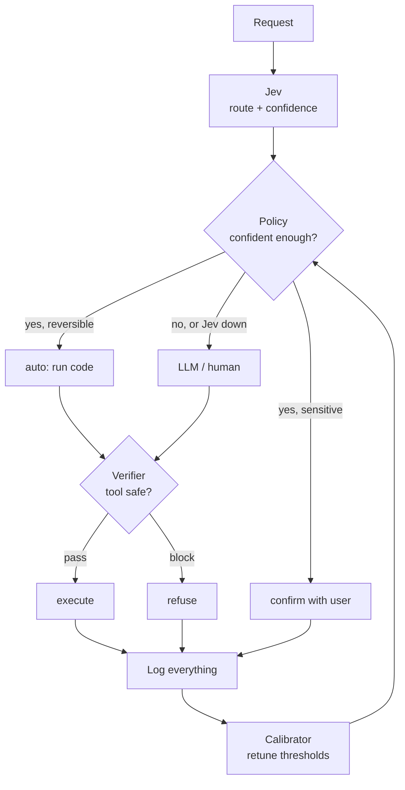

# Adaptive Confidence Gating — Expected-Cost Routing (Jev + LLM)

> Jev decides. Code authorizes. Cost picks the threshold.

This project evolves the [Confidence-Gated Routing](https://docs.typesafe.ai/patterns/confidence-routing) pattern from a fixed threshold (`0.85` global) to **adaptive gating, per action and per slice, optimized by expected cost**.

It is not a `Jev -> LLM` wrapper. It is an **optimizer + audit contract**: given Jev's confidence, the cost of being wrong and the cost of review, the system picks `automate | confirm | escalate` and learns the optimal threshold from your data.

## 1. Why this exists

A single threshold breaks because errors don't cost the same:


| Action                                    | Type                     | C_error           | C_review        | Initial threshold                     |
| ----------------------------------------- | ------------------------ | ----------------- | --------------- | ------------------------------------- |
| `check_balance` / `assign_queue`          | read-only, reversible    | low (e.g. $2)     | $0.5–2          | `~0.60–0.70`                          |
| `draft_llm`                               | recoverable              | medium            | LLM cost        | `~0.75`                               |
| `approve_transfer` / `delete` / `publish` | irreversible / sensitive | high (e.g. $5000) | expensive human | `~0.88–0.95` + mandatory confirmation |


Core rule:

```
Automate when: (1 - p_correct(conf)) * C_error < C_review
```

Where `p_correct(conf)` is **not** raw confidence — it is the measured accuracy on your golden set in that confidence band, for that action, in that slice.

Jev `confidence` (`choice`/`score`) = concentration of the distribution. Useful for routing, not a per-case guarantee. `noul` has no `confidence` — use its own `yes` probability with two cuts.

## 2. Business logic (who decides what)

Jev scores, code authorizes. Every rule below is a constant you can change:

1. **Sensitive actions never auto-execute.** `ACTION_POLICY[action]["confirm_always"]`
   (`src/policy.py`) caps them at `confirm`, even at 0.97 confidence.
2. **Irreversible cases escalate.** `IRREVERSIBLE_NOUL_CUT` (0.70): if Jev's `irreversible`
   probability hits it, the verdict is `confirm`/`human`. Checked before everything else.
3. **Coding tasks proceed, unless huge.** `DEV_TASK_CUT` (0.70) sends attemptable work to
   `llm` in any slice; a confident top-level `scope` score (`DEV_SCOPE_CUT` = 2.0,
   scores are 0-indexed) flips it to `confirm` — file fix proceeds, full refactor asks first.
4. **Below-floor consults cost, not a hardcoded verdict.** Under `FLOOR` (0.60), automate
   iff `(1 - conf) * C_error < C_review` with that slice/action's costs
   (`cost_model.SLICE_COSTS`, else `ACTION_POLICY`). Cheap attempts fall to `llm`, expensive ones stay `human`.
5. **Thresholds are learned per slice/action, caps are declared.** The calibrator scans
   `t` in 0.50-0.97 over labeled `(confidence, correct)` rows and picks the cheapest `t`
   under your `MAX_ERROR` (`eval/report.py`, human-only edits). Thresholds move (by hand or
   controller); caps don't.
6. **Slices are a closed vocabulary** (`src/slices.py::KNOWN_SLICES`, mirrored in the
   `Slice` enum for MCP/HTTP). Unknown names collapse to `default`. Add a name only with
   ~20+ labeled rows behind it. Consumer starter: `agents/AGENTS.md.snippet`.

## 3. Architecture




Code never delegates authorization to the model. High confidence only authorizes a branch the code already knows how to run and is permitted to run.

## 4. Decision contract (log)

Each decision saves one JSONL line:

```json
{
  "ts": "2026-09-20T12:00:00Z",
  "state_hash": "sha256:...",
  "state_snapshot": {"request": "...", "tenant": "...", "permissions": [...]},
  "question_version": "v6",
  "model": "jev-1.13.0",
  "answers": {
    "route": {"choice": "billing", "probabilities": {"billing": 0.82, "...": 0.1}, "confidence": 0.78},
    "risk": {"score": 1.0, "confidence": 0.9},
    "irreversible": {"prob_yes": 0.05}
  },
  "slice": "billing",
  "policy": {"action": "billing_lookup", "threshold": 0.71, "decision": "auto"},
  "outcome": {"correct": null, "feedback_by": null, "cost": null}
}
```

Required fields: `state_snapshot`, `question_version`, pinned `model` (never `jev-latest` in prod), full `probabilities`, `policy_version`, `decision + reason`.

Jev failure (timeout, 429, 529, invalid body) never becomes `auto`. It becomes `llm_fallback` or `human` with `reason=jev_unavailable`.

## 5. Calibration

1. Build a golden set: 200–500 real cases with human labels. Include easy, ambiguous, context-free and unroutable (`other`) cases.
2. Run Jev, group by confidence band **per action and per slice**:

```
conf 0.6-0.7: 68% accuracy | 0.7-0.8: 82% | 0.8-0.9: 91% | 0.9-1.0: 97%
```

1. Plot `coverage (% above threshold) x error (%)` and `total_cost = errors*C_error + reviews*C_review`.
2. Pick the cost-minimizing threshold under an error cap (e.g. error <2% on transfers).

Expected output:

```
threshold 0.60 -> automates 92%, errors 11%, cost $1200
threshold 0.80 -> automates 65%, errors 4%,  cost $480
threshold 0.90 -> automates 28%, errors 1.2%, cost $310 <- best for expensive actions
```

Re-run before changing `question_version` or `model_id`. Roll out gradually, comparing `review_rate` and `error_rate`.

### Bring your own question set

The `route` / `irreversible` / `dev_task` questions in `src/router.py::QUESTIONS` are a
starting point, not the product. Define what Jev analyzes according to your domain —
customer support, programming, triage, moderation — by writing your own typed questions:

```python
QUESTIONS = {
    "route": {  # choice: WHERE does this go? (closed set, max 255 options)
        "type": "choice",
        "instructions": "Which support queue owns this ticket?",
        "criteria": {
            "billing": "Payment, refund, or subscription issue",
            "technical": "Bug, error, or integration issue",
            "other": "None of the above — do not force a fit",
        },
    },
    "vip": {  # noul: binary gate (no confidence field — threshold the value itself)
        "type": "noul",
        "instructions": "Is this customer on a VIP plan?",
    },
}
```

Rules:
1. `choice` = closed set with an `other` escape hatch; `score` = ordered rubric (2–10 levels); `noul` = yes/no probability.
2. One question per independent fact — questions in one call can't see each other's answers. Dependent step? Make two calls.
3. New set = new version: copy `questions/v6.yaml` → `v6.yaml`, point `QUESTION_VERSION` at it, and **recalibrate from zero** — thresholds from the old set mean nothing on the new one.
4. Keep the `irreversible`-style safety question in every set. Jev scores; `policy.py` still authorizes.

## 6. Optimization (online later)

Simple controller, no RL in v1:

```
start conservative (0.90)
every N=100 decisions with feedback:
  if slice_error > target: threshold += 0.05
  if slice_error < target and coverage < goal: threshold -= 0.02
  clamp [0.50, 0.97], per action/slice only, with cooldown
```

Future: contextual bandit using full `probs`, not just `confidence`.

## 7. Repo layout

```
/src
  jev_client.py       # POST /v1/systemone, retry 429/529, timeout
  policy.py           # auto | confirm | llm | human (permissions + cost)
  cost_model.py       # C_error, C_review, E[cost]
  calibrator.py       # coverage x error, suggests thresholds
  controller.py       # online per-slice adjustment
  log.py              # immutable JSONL
  router.py           # Jev -> Policy -> Log wiring
  verifier.py         # agent firewall (noul checks in parallel)
  slices.py           # closed slice vocabulary + normalization
server.py             # HTTP API: POST /route, POST /verify, GET /report
mcp_server.py         # MCP tools: route_request, verify_tool_call, calibration_summary
/eval
  golden_example.jsonl # human labels
  report.py           # accuracy by bin, curves, cost
  label.py            # attach human feedback to the log
/questions
  v6.yaml             # criteria versioned with the code
/agents
  AGENTS.md.snippet   # copy-paste consumer instructions for other repos' AGENTS.md
/tests
  test_smoke.py       # unit tests
README.md
CONFIDENCE_GATING.md  # reference for the previous static pattern
```


## 8. What NOT to do

- Don't use `jev-latest` in prod. Pin `jev-1.x`.
- Don't treat `confidence` as authorization. Permissions stay in code.
- Don't use a global threshold. One per action x risk.
- Don't ask a single generic `is this safe?` question. Check per boundary: input, tool_call, output, citation.
- Don't chain dependent decisions in one call — questions in the same request are independent and parallel. If step 2 depends on step 1, make 2 calls.
- Don't return the classification as the solution.


## 9. Quickstart

Prerequisites: Python 3.10+, a TypeSafe API key ([console.typesafe.ai](https://console.typesafe.ai)).

```bash
git clone <this-repo-url> confidence-gating && cd confidence-gating

make setup   # venv + deps + creates .env — run once
# edit .env: set TYPESAFE_API_KEY=sk-... (keep TYPESAFE_MODEL pinned)

make test    # unit tests — verifies the wiring
make run REQUEST="where is my second invoice copy?"   # first LIVE call
```

That's it. `.env` auto-loads on startup, so there are no exports and no `PYTHONPATH`
to remember — every target below just works. First runs append to `logs/decisions.jsonl`;
inspect the confidence before trusting automation.

Daily use:


| Command                      | What it does                                                     |
| ---------------------------- | ---------------------------------------------------------------- |
| `make run REQUEST="..."`     | one live routing decision, printed as JSON                       |
| `make report`                | calibration (coverage x error) over your labeled log             |
| `make pending`               | list log rows waiting for human feedback                         |
| `make api`                   | HTTP API on :8000 (`POST /route`, `POST /verify`, `GET /report`) |
| `make mcp` / `make mcp-http` | MCP tools for external agents (stdio / streamable HTTP on :8001) |


Config (`.env`; only `TYPESAFE_API_KEY` is required for live calls):


| Var                    | Default                                               |
| ---------------------- | ----------------------------------------------------- |
| `TYPESAFE_API_KEY`     | —                                                     |
| `TYPESAFE_MODEL`       | `jev-1.13.0` (pinned — never `jev-latest` in prod)    |
| `ADAPTIVE_THRESHOLDS`  | `0` (set `1` so `route()` uses controller thresholds) |
| `DECISION_LOG_PATH`    | `logs/decisions.jsonl`                                |
| `THRESHOLD_STATE_PATH` | `logs/thresholds.json`                                |


MCP client example (`claude_desktop_config.json` — adjust paths):

```json
{
  "mcpServers": {
    "confidence-gating": {
      "command": "/abs/path/to/confidence-gating/.venv/bin/python",
      "args": ["/abs/path/to/confidence-gating/mcp_server.py"],
      "env": {
        "PYTHONPATH": "/abs/path/to/confidence-gating",
        "TYPESAFE_API_KEY": "sk-...",
        "TYPESAFE_MODEL": "jev-1.13.0"
      }
    }
  }
}
```

Troubleshooting:

- `jev_unavailable:http_401` → bad/missing key — check `.env`.
- `jev_unavailable:http_429/529` → rate limit/overload; the router retries twice, then falls back to `llm_fallback`/`human` — never `auto`.
- Everything routes to `human` with low confidence → `questions/v6.yaml` criteria are too generic for your domain; label ~50 cases (`make pending`, then `eval/label.py`) and check `make report` bins before lowering thresholds.

References: [Confidence](https://docs.typesafe.ai/confidence) · [Confidence-Gated Routing](https://docs.typesafe.ai/patterns/confidence-routing) · [Models / pinning](https://docs.typesafe.ai/models) · Launch: TypeSafe AI System One + Jev (09/15/2026).